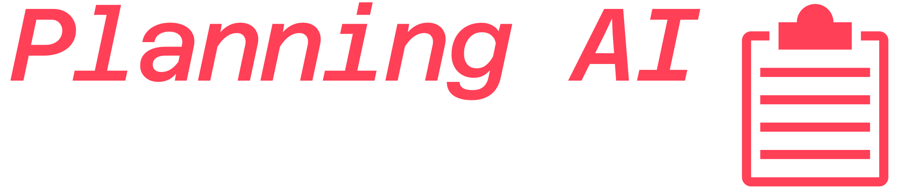
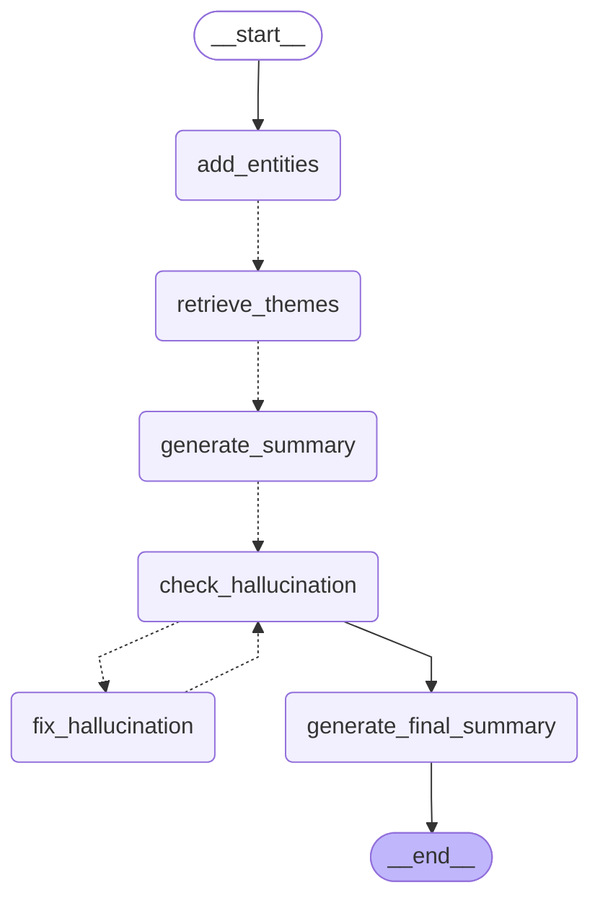

<div align="center">




</div>

## Project Overview

Planning AI is a tool designed to process and analyse responses to local government planning applications. It uses advanced natural language processing techniques to summarise and categorise feedback, providing insights into public opinion on proposed developments.



## Features

- **Document Processing**: Extracts and processes text from various document formats including PDFs and Excel files.
- **Summarisation**: Generates concise summaries each response, highlighting key points and overall sentiment.
- **Thematic Analysis**: Breaks down responses into thematic categories, providing a percentage breakdown of themes.
- **Reporting**: Aggregates response summaries to produce an extensive final overview.

## Installation

To set up the project, ensure you have Python >3.10 installed. Then, clone the repository and install the required dependencies:

```bash
git clone https://github.com/cjber/planning-ai.git
cd planning_ai
pip install . # (or uv sync)
```

## Usage

1. **Preprocessing**: Run the preprocessing scripts to convert raw data into a format suitable for analysis.
   ```bash
   python planning_ai/preprocessing/process_pdfs.py
   python planning_ai/preprocessing/gclp.py
   python planning_ai/preprocessing/web_comments.py
   ```

2. **Run Graph**: Execute the main script to process the documents and generate a Quarto summary document.
   ```bash
   python planning_ai/main.py
   ```

## Configuration

- **Environment Variables**: Use a `.env` file to store sensitive information like API keys.
    - `OPENAI_API_KEY` required for summarisation; `OPENCAGE_API_KEY` required for geocoding (Quarto report)
- **Constants**: Adjust `Consts` in `planning_ai/common/utils.py` to modify token limits and other settings.

## Workflow

1. **Data Loading**: Documents are loaded from the staging directory using the `DirectoryLoader`.
2. **Text Splitting**: Documents are split into manageable chunks using `CharacterTextSplitter`.
3. **Graph Processing**: The `StateGraph` orchestrates the flow of data through various nodes, including mapping and reducing summaries.
4. **Summarisation**: The `map_chain` and `reduce_chain` are used to generate and refine summaries using LLMs.
5. **Output**: Final summaries and thematic breakdowns are used to produce a final Quarto report.
